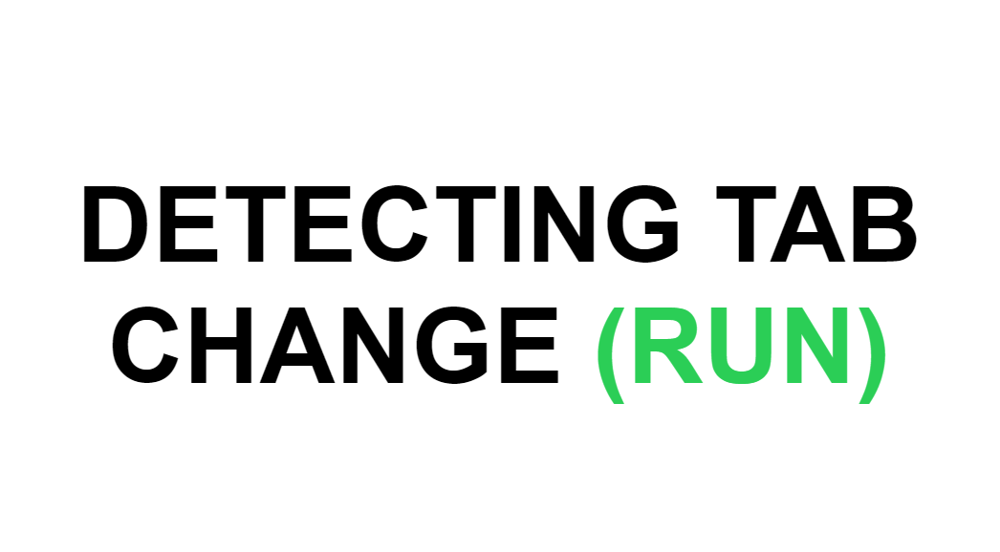
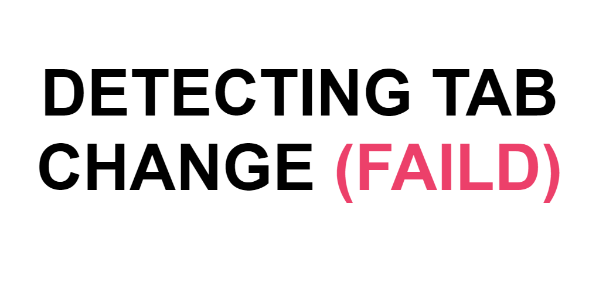

# Detect Tab Change

You will see this page until you exit the browser tab

When you leave the page, you will get an error message and the title of the page will also change

 ### Create with :
  - HTML
  - CSS
  - JavaScript

## Check This Project [Online]()